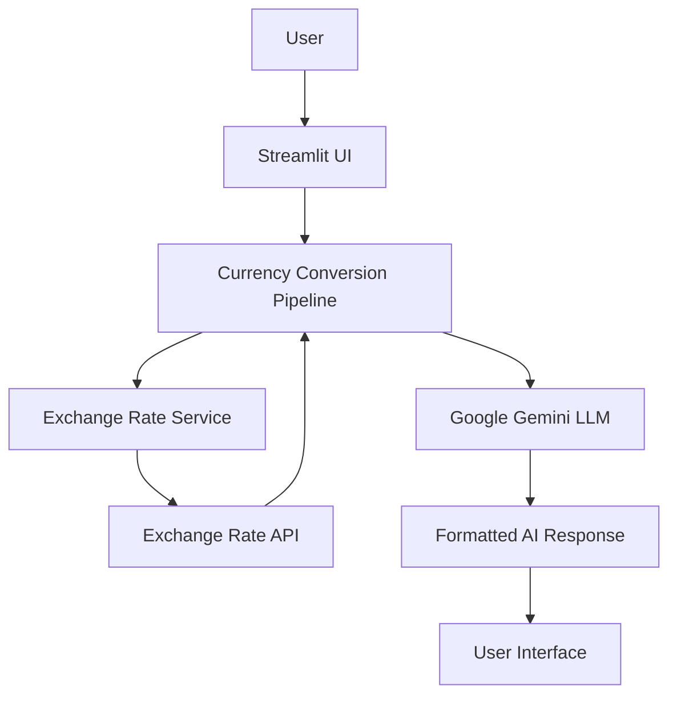
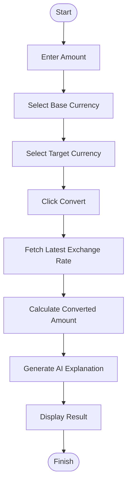

# 💱 AI-Powered Real-Time Currency Converter

<p align="center">
  <b>An intelligent, production-ready currency converter powered by Google Gemini, Exchange Rate API, LangChain, and Streamlit.</b>
</p>

<p align="center">
  Convert currencies in real time and receive AI-generated natural language explanations of every conversion.
</p>

---

## 📌 Badges


 
 
 
 
 


---

# 📖 Project Description

The **AI-Powered Real-Time Currency Converter** is a modern, production-ready web application that combines **real-time exchange rate data** with the reasoning capabilities of **Google Gemini AI**.

Instead of simply displaying converted currency values, the application also generates a clear, human-readable explanation describing the conversion result, making the experience more intuitive and informative.

Built using **Python**, **Streamlit**, **LangChain**, and the **Exchange Rate API**, the project follows industry-standard software engineering practices such as modular architecture, reusable components, centralized configuration management, structured logging, robust exception handling, and secure environment variable management.

### 🎯 Objectives

- Perform accurate real-time currency conversion
- Generate AI-powered explanations for conversion results
- Demonstrate production-grade Python architecture
- Serve as a learning resource for integrating LLMs with external APIs
- Provide an easy-to-deploy application on Hugging Face Spaces

---

# ✨ Features

- 💱 Real-time currency conversion
- 🌍 Supports multiple international currencies
- 🤖 AI-generated conversion explanations using Google Gemini
- ⚡ Fast and responsive Streamlit interface
- 🔐 Secure API key management using `.env`
- 🧩 Modular project architecture
- 📦 Reusable components
- 📝 Centralized logging
- 🚨 Custom exception handling
- ⚙️ Environment-based configuration
- ☁️ Hugging Face Spaces deployment ready
- 📈 Easily extendable for future enhancements
- 🏗️ Production-ready project structure
- 🧹 Clean, maintainable codebase

---

# 🏛️ System Architecture



---

# 🔄 Application Workflow



---

# 📁 Project Structure

```text
AI-Currency-Converter/
│
├── streamlit_app.py
├── requirements.txt
├── setup.py
├── README.md
├── .env.example
│
├── src/
│   ├── config.py
│   ├── logger.py
│   ├── exception.py
│   ├── exchange_api.py
│   ├── llm.py
│   ├── pipeline.py
│   ├── prompt.py
│   ├── utils.py
│   └── currency_converter.py
│
├── logs/
│
├── assets/
│
└── notebooks/
```

---

# 🛠️ Technologies Used

| Technology | Purpose |
|------------|---------|
| Python | Core programming language |
| Streamlit | Interactive web application |
| Google Gemini | AI-generated explanations |
| LangChain | LLM orchestration |
| Exchange Rate API | Real-time exchange rates |
| Requests | API communication |
| Python Dotenv | Environment variable management |
| Pydantic | Data validation |
| Logging | Application monitoring |
| Exception Handling | Error management |
| Git | Version control |
| Hugging Face Spaces | Cloud deployment |

---

# ⚙️ Installation

## Clone the Repository

```bash
git clone https://github.com/Shravan4598/Currency_Conversion_Tool.git
```

```bash
cd REPOSITORY
```

---

## Create Virtual Environment

### Windows

```bash
python -m venv venv

venv\Scripts\activate
```

### Linux / macOS

```bash
python -m venv venv

source venv/bin/activate
```

---

## Install Dependencies

```bash
pip install -r requirements.txt
```

---

# 🔐 Environment Variables

Create a `.env` file in the project root.

```env
GOOGLE_API_KEY=your_google_gemini_api_key

EXCHANGE_RATE_API_KEY=your_exchange_rate_api_key
```

> **Important:** Never commit your API keys to GitHub.

---

# ▶️ Running the Application

```bash
streamlit run streamlit_app.py
```

After running the command, Streamlit will launch the application in your default web browser.

---

# 🚀 Usage

1. Enter the amount you want to convert.
2. Select the source currency.
3. Select the target currency.
4. Click the **Convert** button.
5. View the converted amount.
6. Read the AI-generated explanation produced by Google Gemini.

---

# 💡 Example Output

### Input

```text
Amount : 100

From : USD

To : INR
```

### Output

```text
100.00 USD = 9,547.67 INR
```

### AI Explanation

> Based on the latest exchange rate, **100 US Dollars** is approximately **8,650 Indian Rupees**. The conversion reflects the current market exchange rate retrieved in real time from the Exchange Rate API.

---

# ☁️ Deployment

This project is deployment-ready for **Hugging Face Spaces**.

### Steps

1. Create a new Hugging Face Space.
2. Choose **Streamlit SDK**.
3. Upload the project files.
4. Add your dependencies in `requirements.txt`.
5. Configure the following secrets:

```text
GOOGLE_API_KEY

EXCHANGE_RATE_API_KEY
```

6. Set the application entry point:

```text
streamlit_app.py
```

7. Deploy the application.

---

# 🌟 Project Highlights

- ✅ Production-ready architecture
- ✅ Modular and scalable design
- ✅ Clean code principles
- ✅ Industry-standard folder structure
- ✅ AI-powered user experience
- ✅ Beginner-friendly implementation
- ✅ Secure API key management
- ✅ Easy to customize and extend
- ✅ Ready for cloud deployment

---

# 🚀 Future Enhancements

- 📈 Historical exchange rates
- 📊 Currency trend visualization
- 📉 Interactive exchange rate charts
- 🎙️ Voice-based currency conversion
- 🌐 Multi-language support
- ⭐ Favorite currencies
- 📥 Offline caching
- 🤖 Conversational currency assistant
- 🔔 Exchange rate alerts
- 📱 Mobile-first responsive interface

---

# 🤝 Contributing

Contributions are always welcome!

If you'd like to improve this project:

1. Fork the repository.
2. Create a new feature branch.

```bash
git checkout -b feature/your-feature
```

3. Commit your changes.

```bash
git commit -m "Add your feature"
```

4. Push your branch.

```bash
git push origin feature/your-feature
```

5. Open a Pull Request.

Please ensure your code follows clean coding standards and includes appropriate documentation.

---

# 📜 License

This project is licensed under the **Apache License 2.0**.

See the `LICENSE` file for more information.

---

# 👨‍💻 Author

**Name**

Shravan Kumar Pandey

**GitHub**

https://github.com/Shravan4598

**LinkedIn**

https://www.linkedin.com/in/shravan-kumar-pandey-309786309/

---

# 🙏 Acknowledgements

Special thanks to the following amazing technologies and communities:

- Google Gemini
- Exchange Rate API
- Streamlit
- LangChain
- Hugging Face
- Python Community
- Open Source Contributors

---

<div align="center">

## ⭐ If you found this project helpful, consider giving it a Star!

Made with ❤️ using **Python**, **Streamlit**, **Google Gemini**, **LangChain**, and **Exchange Rate API**.

</div>
